# 方波的傅里叶分解与合成 (Square Wave Fourier Synthesis)

> 模拟电路实验最终课程设计复现。曾经在实验室里被这个项目按在地上摩擦，现在重新用 LTSpice 严谨推导与仿真，才发现当初的自己对傅里叶级数和有源滤波的物理现实一无所知。以此项目，一雪前耻。

---

## 项目总览 (Overview)

本项目使用运算放大器、电阻、电容构建一套完整的模拟信号处理系统：首先产生特定频率的方波，然后利用有源滤波器将其分解为**基波 (1次)、三次谐波、五次谐波**，最后通过相位对齐和加法器，将这些谐波重新合成为带有吉布斯现象（Gibbs Phenomenon）的方波。

**数学原理：**
根据傅里叶变换，完美的方波信号由无数个奇次正弦波组合而成：

$$
V(t) = \sin(\omega t) + \frac{1}{3}\sin(3\omega t) + \frac{1}{5}\sin(5\omega t) + \dots
$$

本实验仅提取前三次奇次谐波（更高次谐波衰减极大且耗费运放成本过高）。

**系统架构流水线：**
1. **方波发生器 (Square Wave Generator)**
2. **多路反馈带通滤波器 (MFB Band-pass Filters, 提取 2k/6k/10k 谐波)**
3. **全通移相器 (All-Pass Phase Shifters, 解决相位畸变)**
4. **反相加法器 (Summing Amplifier, 波形重构)**

---

##  一、 方波发生器 (Square Wave Generator)

我们目标生成一个频率约为 `2kHz` 的完美方波。

*(之前实验室用的 OP07 压摆率低得感人，生成的方波边缘极其倾斜。本次仿真全面换用 **LT1056** 高速 JFET 运放，压摆率充足。)*

**改进点与避坑：**
很多教科书上的经典振荡电路直接将稳压管反向并联接入，这会导致极大的短路电流。我在后端增加了一个分压电阻 $R_4$ 进行限流，并增加了一个**全局电压跟随器 (Buffer)**，用于彻底隔离后续并联三大滤波器带来的动态负载变化。

**频率计算：**
充放电时间常数决定了方波周期：    
$$
T = 2R_p C \ln3
$$
设定供电为 $\pm12\text{V}$，计算出理论频率为 `2068.72 Hz`，非常接近目标。

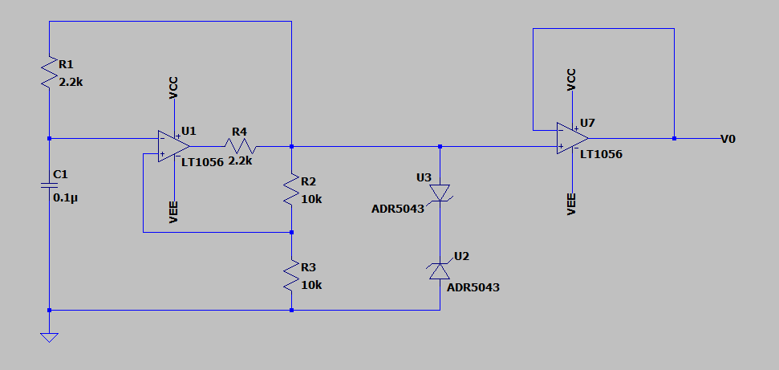
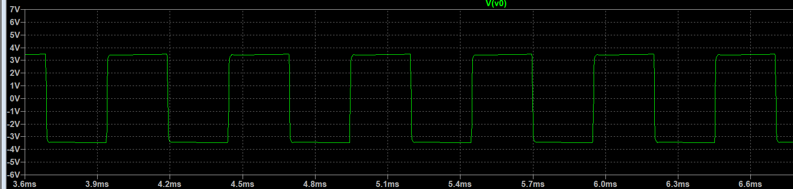

---

## 二、 谐波提取滤波器 (Harmonic Extractor Filters)

为了精确提取谐波且不改变其原有的振幅比例，所有带通滤波器的中心频率电压增益 $|A_0|$ 均设定为严格的 `1` (0dB)。我们采用**无限增益多路反馈 (MFB) 拓扑**。

### 1. 基波通道：2kHz 带通滤波器
* **参数设定：** $f_0 = 2\text{kHz}$, $Q = 3$, $C = 10\text{nF}$
* **表现：** 基波在方波中能量占比极其碾压。虽然理论上一级即可，但为了追求极致完美的正弦波，我选择级联了两级。

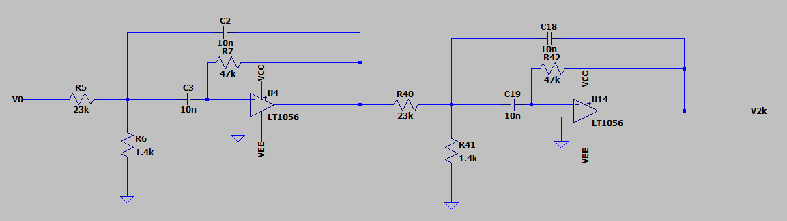
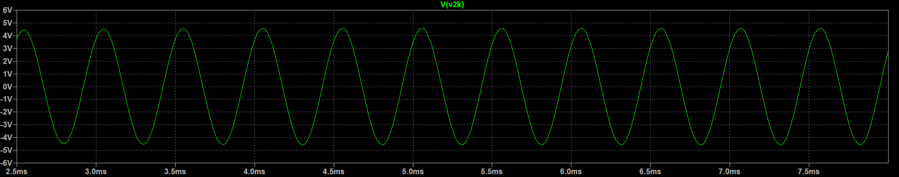

### 2. 三次谐波通道：6kHz 带通滤波器
* **核心难点：** 6kHz 谐波的初始幅值仅为基波的 1/3。如果只用一级滤波器，漏过来的 2kHz 基波能量依然高达 30% 以上，会导致输出波形产生极其难看的“拍频”低频包络。
* **解法：** 必须使用数量换质量！此处我级联了 **3 级** $Q=3$ 的 MFB 滤波器，将 2kHz 的干扰死死压制在 -45dB 以下。
* **硬件对准 (Alignment)：** 真实方波的谐波不一定是绝对的 6000Hz。接地电阻必须使用电位器。在仿真中，我使用了 `.step param` 交流扫频指令，精确找到了让 6kHz 峰值共振的最佳阻值。

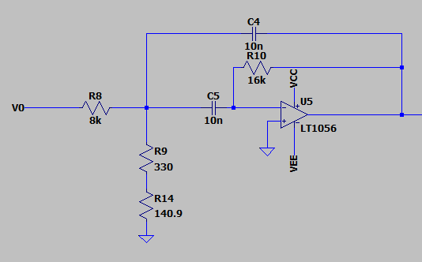
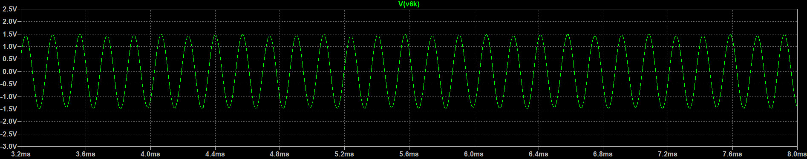

### 3. 五次谐波通道：10kHz 带通滤波器
* **核心难点：** 10kHz 幅值仅为基波的 1/5，且面临 2kHz 和 6kHz 的双重低频干扰碾压。
* **解法：** 采用更夸张的 **4 级级联**。

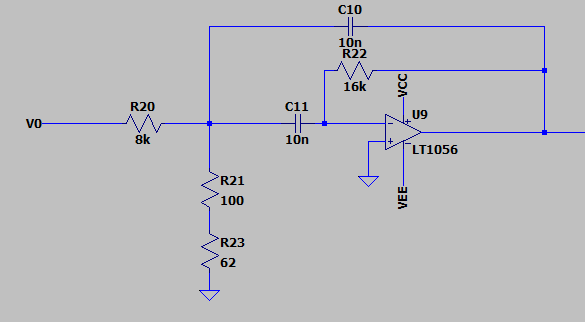
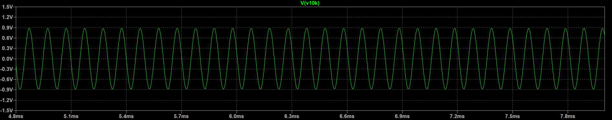

> **💡 仿真避坑经验 (The Transient Trap):** > 级联多次会导致初始能量蓄积时间大幅延长。在跑 `.tran` 瞬态仿真时，千万不要看前几毫秒那像过山车一样的建立过程（直流失调和暂态响应），一定要把时间拉长到 `15ms` 以后，才能看到完美的稳态波形。

---

## 三、 移相器 (All-Pass Phase Shifters)

**这是本次实验最硬核、也是最容易被忽视的死角！**

MFB 滤波器不仅会衰减幅值，还是一个“相位粉碎机”。高 $Q$ 值的级联滤波器会让 6kHz 和 10kHz 的波形产生几百度的随机相移。如果直接相加，合成出来的绝对是一坨乱码。

**目标：过零点绝对对齐 (Zero-Crossing Alignment)**
基准是 2kHz 基波。6kHz 和 10kHz 必须与 2kHz 在同一瞬间发生正向过零。

### 1. 6kHz 移相器 (拓扑翻转法)
通过 FFT 抓取，我发现 6kHz 此时的相位大约为 $-208^\circ$。而标准的高通型全通滤波器（提供 $180^\circ \sim 0^\circ$）存在物理死角，根本盖不住 $-208^\circ$。
**解法：** 将 RC 拓扑对调（电容接地，电阻接输入），将其改造成低通型全通滤波器，成功获得 $0^\circ \sim -180^\circ$ 的补偿范围，完美对齐！

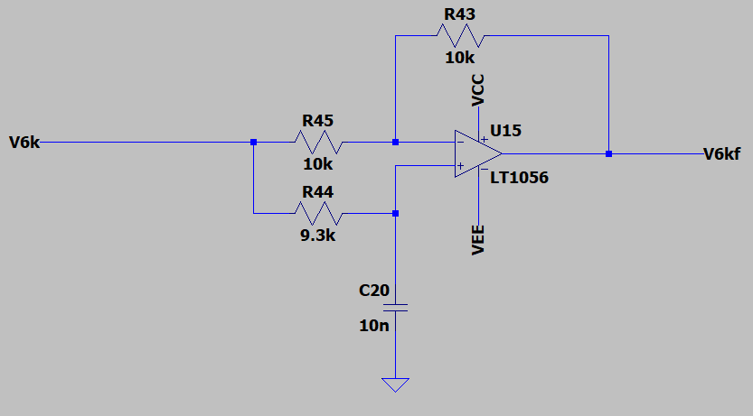

### 2. 10kHz 移相器
10kHz 需要 $+39^\circ$ 的相位补偿，正好在标准高通型移相器的火力覆盖范围内。通过调节同相输入端的电位器，配合示波器盯紧 2kHz 基波的过零点，手动“拧”到重合即可。

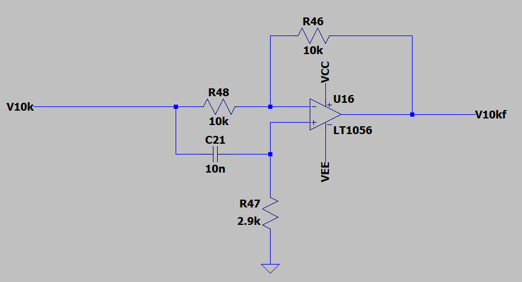

---

## 四、 最终合成 (The Summing Amplifier)

由于我们在滤波和移相阶段，都严格保证了 $|A_0| = 1$ 的无损传输，此时这三路纯净正弦波的振幅比例依然完美保持在 $1 : 1/3 : 1/5$。

最后，我们只需用一个最简单的 $1:1:1$ 反相加法器将它们汇总。

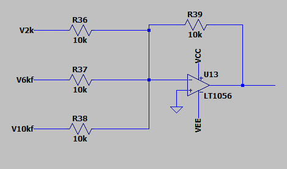

### 🎉 见证奇迹的最终输出
带有明显“吉布斯现象 (Gibbs Phenomenon)”小波峰的残缺方波，被纯粹的模拟电路从无到有“拼”了出来，完全符合数学预期！

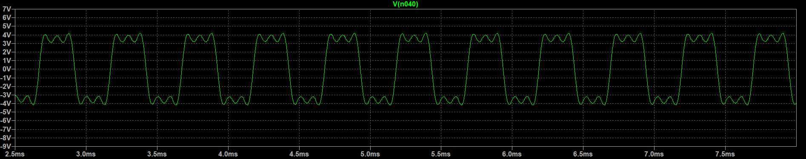

---

## 五、 战后总结 (Conclusion)

总览整个设计，由于我对纯净正弦波有极度的“波形洁癖”，大量使用了级联架构。清点一下兵力：
* 我总共消耗了 **14 个** LT1056 运算放大器。
* 大量使用了不符合 E24 标准的奇葩电阻阻值（现实中必须手搓电位器）。

我依稀记得当年实验室的变态要求是“运放不得超过 7 个”... 毫无疑问，如果在现实中交这份答卷，我的经费已经超标两倍了。

**不过，管他呢，所幸最终这方波是真的好看啊！**
